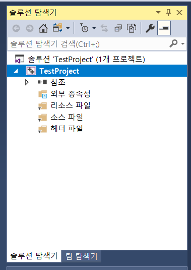
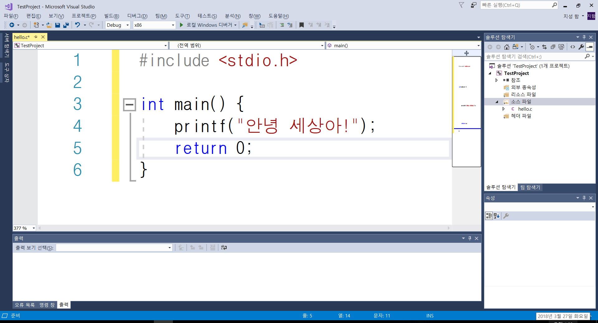

#### 1 주차

#### 1주차 학습 목표

#### : **프로그래밍과 프로그래밍 언어의 발전, **C언어 vs Python, C언어로 된 프로그램 만들기

## 1. **프로그래밍과 프로그래밍 언어의 발전**

* #### 프로그래밍\(Programming = Program + ing\)이란 무엇일까?
* #### 간단하게 말하면, 내가 생각하는 것을 컴퓨터도 알아 들을 수 있는 코드로 표현하는 것이다.

##### 

하지만, 컴퓨터\(기계\)가 사용하는 언어\(기계어 : 0 혹은 1로 된 신호\)와 사람이 사용하는 언어\(자연어\)는 체계나 모양이 많이 다릅니다.

따라서, 기계와 사람의 중간 정도 관점에서 각각의 언어로 번역될 수 있도록 구성한 언어를 고안하게 되었고, 이를 **어셈블리어\(Assembly Language\)**라고 부른다.

어셈블리어의 주된 특징은 어셈블리어로 된 명령 한 줄이 기계어 명령 한 줄로 거의 대부분 1:1 대응된다는 점이다. 또한, 인간의 관점에서 어셈블리어로 된 코드를 해석하는 것은 기계어를 직접 해석하는것에 비하면 훨씬 더 쉽고 주석도 달 수 있다고 한다 ~~\(오 개꿀\)~~.

하지만 이러한 장점~~\(과연..?\)~~에도 불구하고 어셈블리어는 CPU\(컴퓨터의 중앙처리장치\) 설계 방식이나 어셈블러\(기계어를 어셈블리어로 바꾸어주는 프로그램\)별로 그 문법이 통일되지 않아 이식성\(다른 컴퓨터로 옮겨서 해당 프로그램을 실행시켰을 때 잘 실행 되는지\)이 떨어졌고, 어셈블리어에 익숙하지 않은 일반인은 어셈블리어로 복잡한 프로그램\( 예 : 별찍기 프로그램 \)을 만들기 위해서 ~~어엄청~~ 많은 노력이 필요했다.

이렇듯 어셈블리어는 자연어보다는 기계어에 가까운 로우레벨 언어\( 혹은 저급 언어\)였기 때문에, 보다 자연어에 가까우면서 쉽고, 이식성이 뛰어난 프로그래밍 언어\(하이레벨 언어, 혹은 고급 언어라고 불리우는 언어\)를 요구하게 되었다.

Low Level Language \( Easy for computers to understand \) &lt;-------&gt; High Level Language \( Easy for humans to understand \)

### 기계어 --- 어셈블리어 ---------------------------------------------- 자연어

그런데 우리가 곧 배우게 될 C언어는 당시 이러한 요구에 부합하는 ~~조흔~~ 언어였다.

그 이유로서

1. C언어는 어셈블리어나 기계어에 비하면 인간이 읽기에 꽤 괜찮은 수준의 가독성과 시인성을 자랑한다.
2. 범용적으로 사용할 수 있는 프로그래밍 언어를 지향하였기에 C언어를 이용해 거의 대부분의 프로그램을 만들 수 있었다.
3. C언어는 기본적인 공학에서 다루는 제어 흐름을 조작하는 방법들을 제공하고 있었기 때문에 보다 구조적인 설계가 가능하다.

하지만, 여전히 C언어는 비교적 저급언어에 속한다.

### 기계어 --- 어셈블리어 -------- C언어 ------------------------------ 자연어

왜냐하면 C언어는 어셈블리어와 유사하게 프로그래머가 기계\(키보드, 모니터, 마우스, 메모리 등\)를 직간접적으로 제어할 수 있기 때문입니다. 대표적으로 우리가 가장 마지막에 배울 포인터를 이용하면 프로그램에서 필요한 메모리를 간접적으로 제어할 수 있게 됩니다.

## 2. C언어 vs Python

C언어에 이어, 한양대학교 컴퓨터소프트웨어학부 1학년에 입학한 여러분들이 '소프트웨어 입문 설계' 과목 시간에 배웠거나, 배우고 있는 중이거나, 곧 배울 예정인 'Python'이라는 프로그래밍 언어는 기계어보다는 자연어에 가까운 프로그래밍 언어라고 일컬어집니다. 왜냐하면, 사람이 쓰는 자연어처럼 인간에게 보다 직관적이고 친숙한 형태로 언어가 설계되었기 때문입니다. 그래서 대부분의 사람들도 파이썬은 쉽게 배울 수 있습니다.

### 기계어 --- 어셈블리어 -------- C언어 ----------------Python------ 자연어

하지만, 파이썬은 같은 코드라 할 지라도 C언어에 비해 실행 속도가 느린 단점이 있습니다. 이는 파이썬이 인터프리팅 언어이기 때문인데요.

C언어로 만든 프로그램은 컴파일이라는 과정을 거쳐 바로 실행 가능한\(완성된 기계어로 된\) 프로그램이 되는 반면, 파이썬으로 만든 프로그램은 코드를 파이썬 해석기\(Python Interpreter\)가 읽어가며 실행시켜주는 방식이기 때문에 C 코드로 작성한 프로그램이 바로 실행 가능한 것에 비해 파이썬 프로그램은 Python 코드를 읽고, 해석하여, 실행하는데 시간이 더 지체됩니다.

그러면 어떤 언어가 더 나은 언어일까요?

그 것은 상황에 따라 C 언어가 더 좋을 수도 있고, 파이썬이 더 좋을 수 있기 때문에 그때 그때 다릅니다.

그렇다면 언제 C언어를 쓰고, 언제 파이썬을 쓸까요?

그건 언어를 사용하는 여러분들에게 맡기겠습니다.

저는 성능이 중요시될 때는 C언어를, 내가 생각한 아이디어를 빠르게 구현해볼 때는 python을 쓰려고 합니다만, 이건 정답이 없는 문제 같습니다.

## 3. C언어로 된 프로그램 만들기

C언어로 된 프로그램을 만들기 위해서 필요한 것은

* C 코드를 작성할 수 있는 **편집기\(Editor\)**

  * Notepad
  * Emacs
  * Sublime Text
  * vi/vim

  * VS Code

  * Atom

  * Notepad++

  * etc...

* 작성된 C 코드를 기계어로 번역하는 **C 컴파일러\(C Compiler\)**

  * gcc
  * mingw+gcc

  * lcc-win32

  * ICC\(Intel C++ Compiler\)

  * clang

  * LLVM

  * Pelles C

  * Microsoft Visual C/C++ Compiler

  * etc...

두 가지가 필요합니다

.

그리고 코드 편집과 컴파일을 묶어서 간편하게 만든 프로그램도 존재합니다.

이름하여 통합 개발 환경\(Integrated Development Environment\)라 불리는 것들 입니다.

IDE의 종류는

* ###### Microsoft Visual Stduio\(for Window user\)
* ###### Xcode\(for Mac user\)
* ###### Code Blocks
* ###### Eclipse CDT

가 있습니다.

그렇지만.. 저는 수업의 편의를 위해서 Microsoft Visual Studio 로 수업을 진행하려고 합니다.

1. [https://docs.microsoft.com/ko-kr/visualstudio/install/install-visual-studio](https://docs.microsoft.com/ko-kr/visualstudio/install/install-visual-studio "Visual Studio 2017 Download Page") 에 접속합니다.
2. '2단계 - Visual Studio 다운로드' 에 있는 VISUAL STUDIO 2017 다운로드를 클릭합니다.

3. Visual Studio Community 2017 \(학생 및 오픈소스 개발자를 위한 모든 기능을 갖춘 무료 IDE\)을 누릅니다.

4. 다운로드 받은 파일\(**vs\_community~.exe\)**을 실행합니다.

5. 사용 약관 및 개인정보처리방침에 동의를 눌러줍시다.

6. 'C++을 사용한 데스크톱 개발'에 체크하고, 설치 버튼을 눌러 설치를 진행한다.

7. 설치가 완료되면, 실행 버튼이 활성화 되는데 실행을 눌러 Visual Studio를 실행한다.

8. 나중에 로그인을 눌러 진행한다.

9. 마음에 드는 에디터 색상을 선택한다.

\[Visual Studio 시작 화면\]

Visual Studio는 모든 프로그램을 프로젝트 단위로 관리한다. 따라서, 프로젝트를 생성하자.

\[Visual Studio 프로젝트 생성\]방법은 간단하다.

1\) 파일 -&gt; 새로 만들기 -&gt; 프로젝트 선택

\[새 프로젝트 만들기 및 세부 설정\]

2\) 프로젝트 세부 옵션을 설정한다.

'**Windows 데스크톱 마법사**'를 선택

> 이름 : 자유롭게 정하기
>
> 위치 : 프로젝트 파일이 저장될 위치를 지정하거나, 아무것도 건들지 않으면 기본 위치가된다. 선택
>
> '솔루션용 디렉토리 만들기' : 체크시 관련된 파일들을 새 폴더를 만들어 모아준다.
>
> 확인 버튼을 눌러서 다음 단계로 진행한다.


3\) 프로젝트 세부 설정

* 응용 프로그램 종류 : 우리가 만들고자 하는 프로그램의 종류이다. '콘솔 응용 프로그램\(.exe\)'로 설정하자.

* 빈 프로젝트 : 어떤 소스 코드 파일도 프로젝트를 생성할 때 미리 만들지 않고 싶을 때 사용한다. \(체크한다\)

* 미리 컴파일된 헤더 : 위와 마찬가지로 VS가 나 대신 만들어주는 통합 헤더 파일을 미리 만들어준다. \(체크 해제 한다\)

* SDL 검사 : 보안 강화를 위해 적용되는 검사기능이다. 나중에 이게 무엇인지 확인해볼 것이다. \(체크 해제 한다\)

* 확인 버튼을 눌러서 진행

\[솔루션 탐색기\]




4\) **프로젝트가 만들어지면 솔루션 탐색기에 \[내가 정한 프로젝트 이름\]으로 된 폴더 구조의 무언가가 나타난다.**

일반적으로 Visual Studio에서 하나의 프로젝트는

> 소스파일 \(.c\)
>
> 헤더파일 \(.h\)
>
> 리소스 파일 \(기타 등등\)

등으로 구성된다.


5\) 일단 소스코드를 작성하기 위해

1\) 소스 파일에 마우스 오른쪽 버튼을 클릭하고

2\) 추가 -&gt; 새 항목을 클릭한다.


6\) **새 항목 추가 화면에서**


C++ 파일로 선택하고, 소스코드 파일이름을 입력한다

# 이때 확장자는 **.c**로 바꾼다.

~~\(그래야 C++ 컴파일러가 아닌 C 컴파일러로 컴파일이 된다. 두개가 어떤 차이가 있는지는 2학기 때 배울 수 있다.\)~~

그리고 추가를 눌러 파일을 프로젝트에 추가하자.



그렇게 해서 새로 만들어진 파일을 솔루션 탐색기에서 열고 다음의 내용을 오타 없이 그대로 따라써봅시다.

```c
#include <stdio.h>

int main() {
	printf("안녕 세상아!");
	return 0;
}
```

해당 코드를 작성한 후 이 프로그램을 실행한 결과가 어떻게 될지 한번 예상해봅시다.

그리고 예상한 결과가 맞는지 확인하기 위해, 파일을 저장하고, 상단 메뉴에 디버그 - 컴파일하지 않고 시작\(Ctrl + F5\)를 눌러 프로그램을 실행시켜보자.

내가 처음에 예상했던 실행 결과와 실제 실행한 결과가 서로 일치하는지 확인해봅시다.

**오늘 수업은 여기까지 입니다. 별도의 숙제는 없습니다.**

